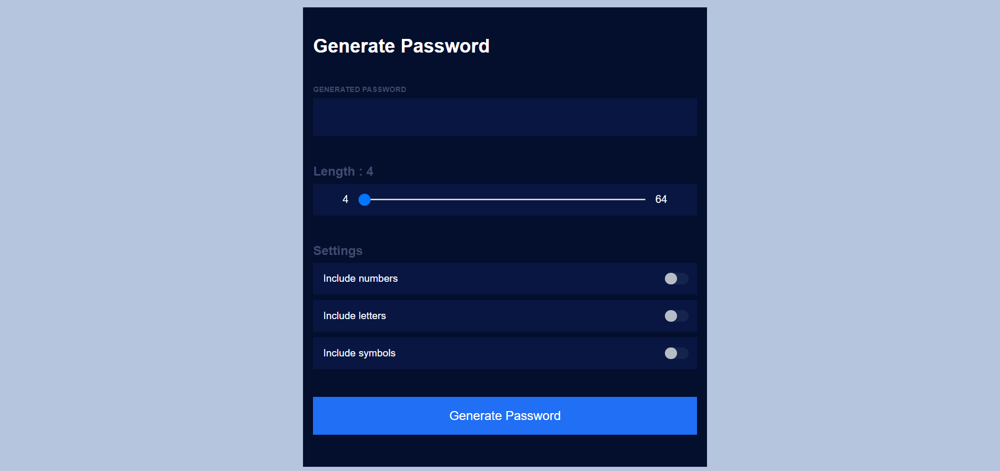
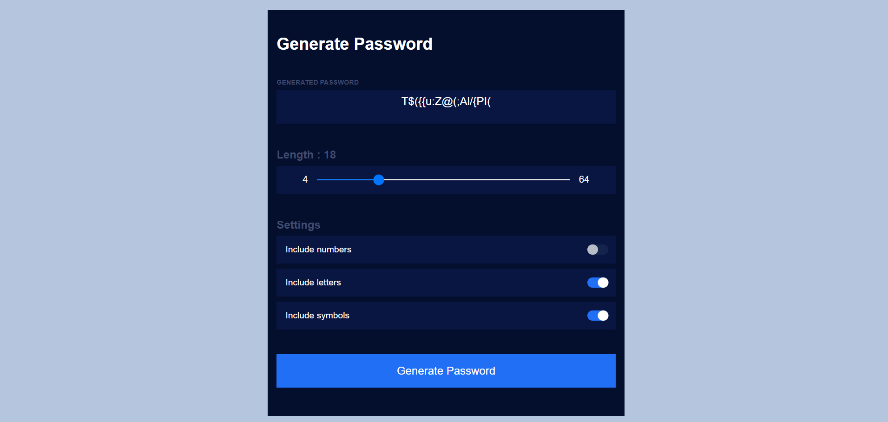
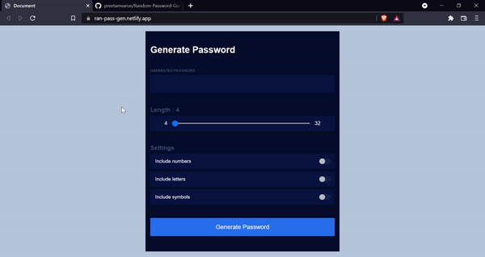

**Random-Password-Generator** : :jack_o_lantern:
A web app that is built with **HTML5,CSS3 & Vanilla JAVASCRIPT**  

## Table of contents
1. [General Info](#general-info-)
- [Screenshots](#screenshots-)
- [Preview](#preview-)
- [Installation](#Installation-)
- [Technologies](#Technologies-Used-)
- [live-demo](#live-demo)
- [features](#features)
- [Upcoming features](#Upcoming-features)

## General Info 📝
The purpose of this project is to understand and implement the javascript concepts that i've learned to make the user interface look appealing besides having fun along the journey :smiley:.

## 2. Screenshots 📸




## 3. Preview 🎥



## 4. Installation 📀

#### Clone the repo

```sh
$ git clone https://github.com/preetamvarun/Pig-Game.git
$ cd Pig-Game/
```

#### Run the app
```sh
open index.html with a browser you prefer
```
## 5.Technologies Used ✳️

[](https://devdocs.io/javascript/)   
[](https://devdocs.io/html/)   
[](https://devdocs.io/css/) 

## 6. live-demo 👾
https://ran-pass-gen.netlify.app/

## 7. Features
User friendly 🔥 <br>
clean UI ⭐ <br>
Responsive 😉

## 8. Upcoming features 🌠
Copy to clipboard functionality

